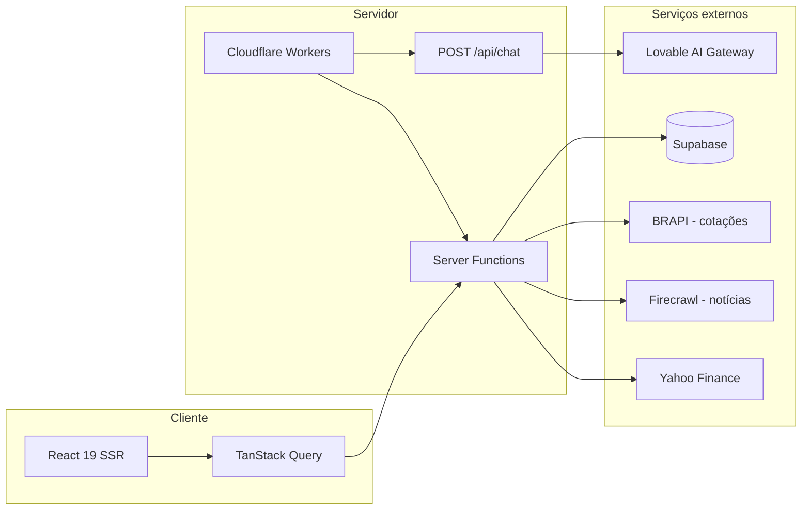
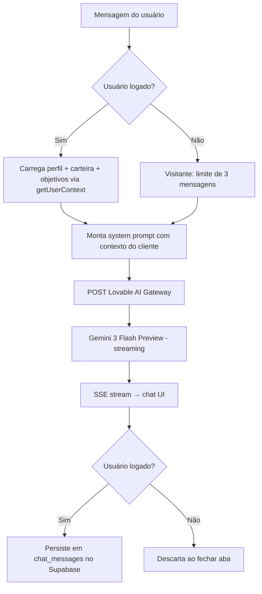
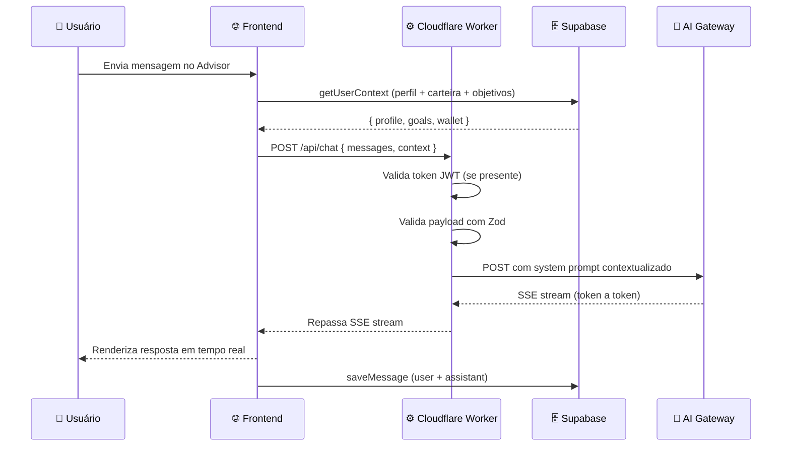

<p align="center">
  
</p>

<h1 align="center">Quantara · Wealth Intelligence</h1>

<p align="center">
  Dashboard de wealth management que consolida carteiras de 12 casas private (XP, BTG, J.P. Morgan, Julius Baer e mais) em uma visão unificada, com IA contextual, perfil de suitability e acompanhamento patrimonial.
</p>

<p align="center">
  
  
  
  
  
</p>

---

## ✨ O que o Quantara faz?

Imagine que um investidor quer entender como balancear sua carteira:

> "Tenho R$ 2M alocados. Perfil moderado. Devo migrar parte para Treasuries com o dólar nesse patamar?"

O Quantara automaticamente:

- Carrega o **perfil de suitability** do usuário (Conservador, Moderado ou Arrojado)
- Cruza com carteiras reais de **XP, BTG, J.P. Morgan, Julius Baer** e outras 8 casas
- Responde via **IA contextual** citando % CDI, IPCA+, yield e comparativos em tabela
- Exibe o **DiagnosticCard** com alocação atual vs. ideal e 3 recomendações acionáveis

Tudo em tempo real, sem precisar consultar cada corretora separadamente.

---

## 🚀 Funcionalidades

| Feature | Descrição |
|---|---|
| 📊 **Dashboard ao vivo** | IBOV, S&P 500, USD/BRL, DI e Bitcoin com refetch automático a cada 60s via BRAPI |
| 🤖 **Advisor IA** | Chat com especialista de wealth management. Visitantes têm 3 mensagens grátis; logados têm histórico persistido no Supabase |
| 🎯 **DiagnosticCard** | Compara alocação atual do usuário com a ideal para seu perfil e gera 3 recomendações acionáveis |
| 🏦 **Carteiras private** | 12 casas mapeadas com picks, tese, retorno esperado, risco e aporte mínimo |
| 📈 **Evolução patrimonial** | Snapshot mensal automático do patrimônio total por categoria, com gráfico de área histórico |
| 🔐 **Suitability** | Questionário no `/advisor` ou onboarding de 3 passos que define o perfil Conservador / Moderado / Arrojado |
| 🌐 **Bilíngue** | Interface completa em PT-BR e EN |
| 📰 **Notícias ao vivo** | Feed de notícias de mercado via Firecrawl com refresh automático |
| 🔒 **Dados isolados por usuário** | Row Level Security no Supabase: `auth.uid() = user_id` em todas as tabelas |

---

## 🔄 Fluxos de dados

### 1. Visão geral da arquitetura



### 2. Fluxo do Advisor IA



### 3. Fluxo de snapshot patrimonial

```mermaid
flowchart LR
    Load[/patrimonio carrega] --> HasAssets{Tem ativos?}
    HasAssets -->|Não| Empty[Tela vazia com CTA]
    HasAssets -->|Sim| Snap[ensureMonthlySnapshot]
    Snap --> Check{Snapshot deste mês já existe?}
    Check -->|Sim| Skip[Não faz nada]
    Check -->|Não| Upsert[INSERT patrimony_snapshots com total + breakdown por categoria]
    Upsert --> Refetch[Recarrega listSnapshots]
    Refetch --> Chart[AreaChart com série histórica]
```

### 4. Fluxo de requisição completo



---

## 🛠️ Tecnologias

### Frontend / Framework

| Tecnologia | Uso |
|---|---|
| React 19 | UI com Suspense, use() e concurrent features |
| TanStack Start | SSR + file-based routing + server functions |
| TanStack Router | Roteamento type-safe com `createFileRoute` |
| TanStack Query | Cache, refetch automático, invalidação |
| Vite | Build e HMR |

### UI / Estilo

| Tecnologia | Uso |
|---|---|
| Tailwind CSS v4 | Estilo utilitário com CSS variables |
| shadcn/ui + Radix | Componentes acessíveis (Dialog, Select, Toast…) |
| Recharts | Gráficos: AreaChart, PieChart |
| Framer Motion | Animações de entrada e transições |
| Lucide React | Ícones |
| Sonner | Toasts |
| React Markdown + remark-gfm | Renderização de respostas da IA |

### Backend / Dados

| Tecnologia | Uso |
|---|---|
| Supabase | Postgres + Auth + RLS |
| Cloudflare Workers | Runtime de produção via Wrangler |
| Zod | Validação de inputs em server functions e API handlers |
| React Hook Form | Forms controlados |

### Integrações externas

| Serviço | Uso |
|---|---|
| Lovable AI Gateway | Chat do Advisor (Gemini 3 Flash Preview, streaming) |
| BRAPI | Cotações ao vivo: B3, USD/BRL, DI |
| Yahoo Finance | Dados complementares de ativos |
| Firecrawl | Scraping de notícias de mercado em tempo real |

---

## 🗄️ Banco de dados

Todas as tabelas têm Row Level Security com política `auth.uid() = user_id`.

```
profiles
  id              uuid  PK
  user_id         uuid  FK → auth.users  UNIQUE
  display_name    text  nullable
  suitability     text  Conservador | Moderado | Arrojado
  created_at      timestamptz
  updated_at      timestamptz  (trigger automático)

wallet_assets
  id      uuid  PK
  user_id uuid  FK → auth.users
  kind    text  investimento | imovel | veiculo | conta | previdencia | cripto | seguro | alternativo
  name    text  max 120 chars
  value   numeric  0 – 1_000_000_000_000
  note    text  nullable, max 200 chars

user_goals
  id             uuid  PK
  user_id        uuid  FK → auth.users
  kind           text  19 tipos (aposentadoria, imovel, renda_passiva…)
  target_value   numeric
  horizon_years  numeric  0 – 80
  priority       int  1 – 10
  note           text  nullable

patrimony_snapshots
  user_id       uuid  FK → auth.users   ]
  period_month  date                     ] UNIQUE (chave composta)
  total         numeric
  breakdown     jsonb  { kind: valor }

conversations
  id       uuid  PK
  user_id  uuid  FK → auth.users  UNIQUE (1 por usuário)

chat_messages
  id               uuid  PK
  conversation_id  uuid  FK → conversations
  role             text  user | assistant | system | tool
  content          text  max 20.000 chars (validado via Zod)
  created_at       timestamptz

newsletter_subscribers
  email   text  UNIQUE, max 320 chars
  source  text  nullable
  lang    text  pt | en
```

---

## 🗺️ Rotas

| Rota | Acesso | Descrição |
|---|---|---|
| `/` | Público | Dashboard: IBOV ao vivo, top stocks, DiagnosticCard, notícias |
| `/advisor` | Público + Auth | Chat com Especialista IA contextual |
| `/onboarding` | Auth | 3 passos: perfil de risco → objetivos → snapshot patrimonial |
| `/meu-patrimonio` | Auth | CRUD de ativos com gráfico de composição por categoria |
| `/patrimonio` | Auth | Visão consolidada + gráfico de evolução mensal real |
| `/carteiras` | Público | Carteiras das 12 casas private, filtráveis por categoria |
| `/carteiras/:slug` | Público | Detalhe de carteira: tese, alocação, picks, retorno esperado |
| `/acao/:ticker` | Público | Dados ao vivo de uma ação individual |
| `/comparador` | Público | Comparador de ativos |
| `/cripto` | Público | Painel de criptoativos |
| `/internacional` | Público | S&P 500, BDRs, ETFs internacionais |
| `/noticias` | Público | Feed de notícias de mercado com live refresh |
| `/seguros` | Público | Seguros private (Chubb, AIG, Berkshire, MetLife USD) |
| `/perfil` | Auth | Preferências: display name, tema, idioma |
| `/login` | Público | Autenticação via Supabase |
| `/api/chat` | Server | POST handler para o Advisor (SSE streaming) |
| `/sitemap.xml` | Público | Sitemap dinâmico para SEO |

---

## 🎯 Alocação ideal por suitability

| Classe | Conservador | Moderado | Arrojado |
|---|---|---|---|
| Renda Fixa Pós | 35% | 22% | 8% |
| Renda Fixa Inflação | 30% | 18% | 10% |
| Multimercado | 15% | 12% | 8% |
| Ações Brasil | 10% | 22% | 32% |
| Mundo (EUA) | 8% | 15% | 22% |
| Cripto | 0% | 5% | 12% |
| Alternativos | 2% | 6% | 8% |

---

## 📋 Pré-requisitos

- Node.js 20+ ou Bun 1.1+
- Conta [Supabase](https://supabase.com) com projeto criado
- Conta [Cloudflare](https://cloudflare.com) para deploy
- Conta [Lovable](https://lovable.dev) para o AI Gateway
- Token [BRAPI](https://brapi.dev) (gratuito)
- Chave [Firecrawl](https://firecrawl.dev)

---

## ⚡ Instalação

### 1. Clone o projeto

```bash
git clone https://github.com/seu-usuario/quantara.git
cd quantara
```

### 2. Instale as dependências

```bash
bun install
# ou
npm install
```

### 3. Configure as variáveis de ambiente

Crie `.env.local` na raiz:

```env
# Supabase
VITE_SUPABASE_URL=https://<seu-projeto>.supabase.co
VITE_SUPABASE_PUBLISHABLE_KEY=<anon-key>
SUPABASE_URL=https://<seu-projeto>.supabase.co
SUPABASE_PUBLISHABLE_KEY=<anon-key>
SUPABASE_SERVICE_ROLE_KEY=<service-role-key>

# AI Gateway (Lovable)
LOVABLE_API_KEY=<lovable-api-key>

# BRAPI (cotações B3)
BRAPI_TOKEN=<token>

# Firecrawl (notícias)
FIRECRAWL_API_KEY=<key>
```

### 4. Aplique as migrations

```bash
npx supabase db push
```

Aplica as 9 migrations em `supabase/migrations/`, criando todas as tabelas com RLS e o trigger de criação automática de `profile` no signup.

### 5. Suba o servidor de desenvolvimento

```bash
bun run dev
# ou
npm run dev
```

Acesse `http://localhost:3000`.

---

## 📡 API

### `POST /api/chat`

Envia mensagens para o Advisor IA. Suporta streaming via SSE.

**Headers:**

```
Content-Type: application/json
Authorization: Bearer <supabase-jwt>  (opcional — enriquece o contexto)
```

**Body:**

```json
{
  "messages": [
    { "role": "user", "content": "Compare CDB 118% CDI com Tesouro IPCA+ 2035" }
  ],
  "context": {
    "perfil": "Moderado",
    "patrimonio": "R$ 1.200.000",
    "composicao": "50% renda fixa, 30% ações, 20% multimercado",
    "objetivos": "aposentadoria em 12 anos"
  }
}
```

**Resposta (SSE stream):**

```
data: {"choices":[{"delta":{"content":"## CDB 118% CDI vs Tesouro IPCA+ 2035\n\n"}}]}
data: {"choices":[{"delta":{"content":"| Produto | Rentabilidade bruta | IR | Liquidez |"}}]}
...
data: [DONE]
```

**Limites:**

| Parâmetro | Valor |
|---|---|
| Mensagens por requisição | máx. 80 |
| Tamanho por mensagem | máx. 12.000 chars |
| Total de caracteres na conversa | máx. 200.000 chars |
| Mensagens gratuitas (visitantes) | 3 |

---

## 📁 Estrutura do projeto

```
quantara/
├── src/
│   ├── routes/                        # Rotas file-based (TanStack Router)
│   │   ├── index.tsx                  # Dashboard principal
│   │   ├── advisor.tsx                # Chat com Advisor IA
│   │   ├── onboarding.tsx             # Fluxo de 3 passos
│   │   ├── meu-patrimonio.tsx         # CRUD de ativos
│   │   ├── patrimonio.tsx             # Visão consolidada
│   │   ├── carteiras.tsx              # Listagem de carteiras
│   │   ├── carteiras.$slug.tsx        # Detalhe de carteira
│   │   ├── comparador.tsx
│   │   ├── cripto.tsx
│   │   ├── internacional.tsx
│   │   ├── noticias.tsx
│   │   ├── seguros.tsx
│   │   ├── perfil.tsx
│   │   ├── login.tsx
│   │   ├── sitemap.xml.tsx
│   │   └── api/
│   │       └── chat.ts                # Server handler SSE (AI Gateway)
│   │
│   ├── components/
│   │   ├── DiagnosticCard.tsx         # Alocação atual vs. ideal + recomendações
│   │   ├── Sidebar.tsx                # Navegação lateral com grupos
│   │   ├── charts/
│   │   │   └── MemoAreaChart.tsx
│   │   └── ui/                        # Componentes shadcn/ui
│   │
│   ├── lib/
│   │   ├── wealth.ts                  # Tipos, KIND_META, GOAL_KINDS, fmtBRL
│   │   ├── wealth.functions.ts        # Server fns: listAssets, upsertAsset, getUserContext, snapshots
│   │   ├── chat.functions.ts          # Server fns: getOrCreateConversation, listMessages, saveMessage
│   │   ├── portfolio-by-suit.ts       # Alocação ideal por suitability
│   │   ├── market-data.ts             # Dados estáticos: bankPortfolios, topStocks, índices
│   │   ├── brapi.functions.ts         # Cotações ao vivo via BRAPI
│   │   ├── yahoo.functions.ts         # Dados de ativos via Yahoo Finance
│   │   ├── news.functions.ts          # Notícias via Firecrawl
│   │   ├── newsletter.functions.ts    # Subscribe newsletter → Supabase
│   │   ├── auth.ts                    # useAuth hook
│   │   └── i18n.ts                    # PT-BR / EN translations
│   │
│   └── integrations/
│       └── supabase/
│           └── client.ts              # Cliente Supabase tipado
│
├── supabase/
│   └── migrations/                    # 9 migrations (mai/2026)
│       ├── 20260522023016_*.sql       # Schema inicial: profiles, wallet_assets, user_goals
│       ├── 20260522023030_*.sql       # RLS policies
│       ├── 20260522213808_*.sql       # patrimony_snapshots
│       ├── 20260523003448_*.sql       # conversations + chat_messages
│       ├── 20260523031442_*.sql       # Índices de performance
│       └── 20260525201057_*.sql       # Fix RLS newsletter_subscribers
│
├── public/
│   └── quantara-social-image.png      # OG image
│
├── wrangler.toml                      # Configuração Cloudflare Workers
├── vite.config.ts
├── tailwind.config.ts
├── tsconfig.json
└── package.json
```

---

## 🚀 Deploy

O projeto usa Cloudflare Workers via Wrangler.

### 1. Build

```bash
bun run build
```

### 2. Configure os secrets na Cloudflare

```bash
npx wrangler secret put LOVABLE_API_KEY
npx wrangler secret put SUPABASE_SERVICE_ROLE_KEY
npx wrangler secret put BRAPI_TOKEN
npx wrangler secret put FIRECRAWL_API_KEY
```

### 3. Deploy

```bash
npx wrangler deploy
```

### Variáveis de ambiente em produção

| Variável | Onde configurar |
|---|---|
| `VITE_SUPABASE_URL` | `wrangler.toml` → `[vars]` |
| `VITE_SUPABASE_PUBLISHABLE_KEY` | `wrangler.toml` → `[vars]` |
| `SUPABASE_URL` | `wrangler.toml` → `[vars]` |
| `SUPABASE_PUBLISHABLE_KEY` | `wrangler.toml` → `[vars]` |
| `SUPABASE_SERVICE_ROLE_KEY` | Wrangler secret |
| `LOVABLE_API_KEY` | Wrangler secret |
| `BRAPI_TOKEN` | Wrangler secret |
| `FIRECRAWL_API_KEY` | Wrangler secret |

---

## 📄 Licença

Proprietária. Todos os direitos reservados.

---

<p align="center">
  Feito com React 19, TanStack Start, Supabase e IA generativa
</p>
